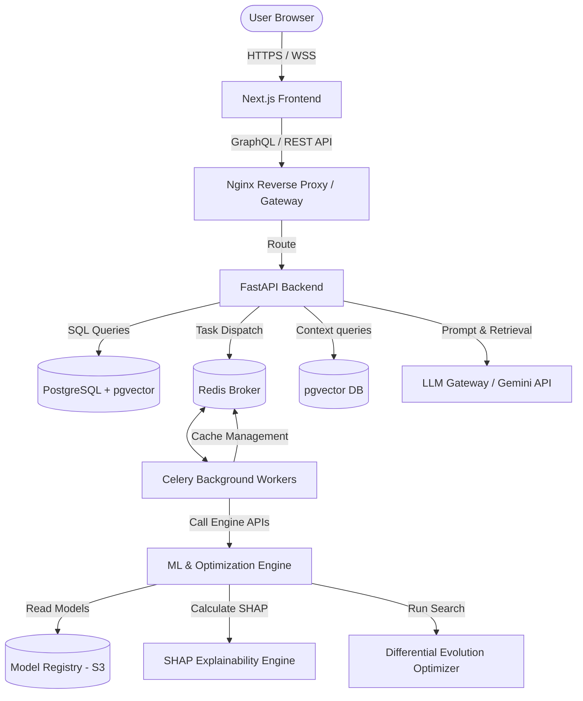
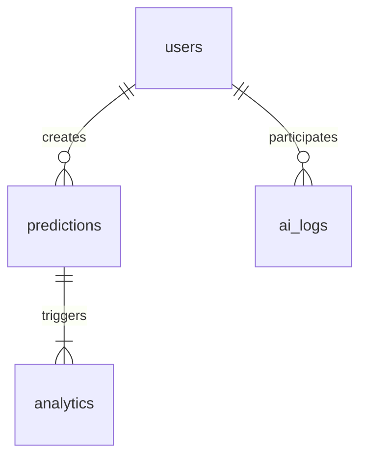

# ChromaMind AI - Architectural Blueprint

This document specifies the complete enterprise-grade software architecture for **ChromaMind AI: An Explainable AI-Powered Intelligent Color Formulation & Optimization Platform**.

---

## 1. Overall System Architecture

ChromaMind AI employs a decoupled, containerized system architecture using **Clean Architecture** for the backend, a **component-driven client layer** on the frontend, and a dedicated microservice/package for **ML and optimization computation**. 

### System Architecture Flow Diagram



### Module Communication Mechanisms
1. **Frontend $\leftrightarrow$ Backend (FastAPI)**: REST APIs for CRUD operations, user session authentication, settings, and prediction history; Server-Sent Events (SSE) or WebSockets for streaming long-running optimization tasks and LLM RAG chat responses.
2. **Backend $\leftrightarrow$ Celery Worker**: Redis handles task queuing. Heavy tasks (ratio prediction, Differential Evolution optimization, and SHAP value generation) are offloaded to background workers to prevent blocking the API gateway.
3. **Celery Worker $\leftrightarrow$ ML Engine**: Deep learning/XGBoost inference models and SciPy-based global solvers run inside background worker contexts with optimized Python bindings, utilizing model weights fetched dynamically from AWS S3 or a local cached directory.
4. **Backend $\leftrightarrow$ LLM (Gemini / OpenAI)**: Secure, rate-limited HTTP connections using backend-stored API keys.

---

## 2. Repository Architecture: Monorepo Design

We adopt a **Monorepo** structure managed using tools like **pnpm Workspaces** (for node modules) and a clean Python directory separation (using **Poetry** virtual environments or **pipenv** workspaces).

### Justification
- **Single Source of Truth**: Share configuration formats, type definitions (compiled from OpenAPI schema), and schemas between the frontend and backend easily.
- **Atomic Commits**: Features spanning the UI, API contracts, and ML interfaces can be committed and tested in a single pull request, ensuring API compatibility.
- **DevOps Simplicity**: Unified Docker Compose environments allow spin-up of the entire application environment locally with a single command (`docker-compose up`).

---

## 3. Complete Folder Structure

Below is the definitive repository structure for ChromaMind AI.

```
chromamind-ai/
├── .github/
│   └── workflows/
│       ├── frontend-ci.yml
│       ├── backend-ci.yml
│       ├── ml-pipeline.yml
│       └── cd-deploy.yml
├── apps/
│   ├── frontend/
│   │   ├── public/
│   │   ├── src/
│   │   │   ├── app/                # Next.js App Router (Layouts & Pages)
│   │   │   │   ├── layout.tsx
│   │   │   │   ├── page.tsx
│   │   │   │   ├── dashboard/
│   │   │   │   └── history/
│   │   │   ├── components/         # Atomic UI Components
│   │   │   │   ├── common/         # Button, Input, Modal, Dropdown
│   │   │   │   ├── color/          # ColorPicker, RatioVisualizer, PaletteCreator
│   │   │   │   ├── chat/           # ChatWindow, MessageBubble, SourceCitations
│   │   │   │   └── analytics/      # DeltaEChart, ConfidenceMeter
│   │   │   ├── hooks/              # Custom React Hooks
│   │   │   ├── services/           # Axios/Fetch API wrappers
│   │   │   ├── store/              # Zustand State Management
│   │   │   ├── styles/             # Global CSS and themes
│   │   │   ├── types/              # TS interfaces (autogenerated from OpenAPI)
│   │   │   └── utils/              # Color conversion & math utilities
│   │   ├── next.config.js
│   │   ├── package.json
│   │   └── tsconfig.json
│   └── backend/
│       ├── app/
│       │   ├── api/                # API Routers (V1)
│       │   │   ├── auth.py
│       │   │   ├── predictions.py
│       │   │   ├── history.py
│       │   │   ├── analytics.py
│       │   │   └── rag.py
│       │   ├── core/               # App configuration, security, database setups
│       │   │   ├── config.py
│       │   │   ├── database.py
│       │   │   ├── security.py
│       │   │   └── exceptions.py
│       │   ├── models/             # SQLAlchemy ORM Models
│       │   ├── schemas/            # Pydantic schemas for request/response
│       │   ├── services/           # Business logic layer
│       │   │   ├── formula_service.py
│       │   │   ├── rag_service.py
│       │   │   └── user_service.py
│       │   ├── repositories/       # Database access abstractions
│       │   ├── middlewares/        # CORS, Logging, Auth headers
│       │   └── main.py             # FastAPI entrypoint
│       ├── tests/
│       ├── Dockerfile
│       ├── pyproject.toml
│       └── requirements.txt
├── packages/
│   ├── ml-engine/
│   │   ├── src/
│   │   │   ├── generator/          # Synthetic dataset generation pipelines
│   │   │   ├── training/           # Train pipelines, features, hyperparameter tuning
│   │   │   ├── inference/          # Ratio predictions and uncertainty estimation
│   │   │   ├── optimization/       # Differential Evolution solver
│   │   │   └── explainability/     # SHAP analysis and summary generation
│   │   ├── models/                 # Local directory for cached weights (.pt, .joblib)
│   │   ├── tests/
│   │   ├── pyproject.toml
│   │   └── Dockerfile
│   └── shared-types/
│       ├── index.ts
│       └── schemas.json
├── data/                           # RAG Knowledge base (PDFs, raw text markdown)
├── docker-compose.yml
├── .env.example
└── README.md
```

---

## 4. Frontend Architecture

### Technology Selection
- **Framework**: **Next.js (v14+)** using App Router for Server-Side Rendering (SSR), Incremental Static Regeneration (ISR), and optimized asset delivery.
- **State Management**: **Zustand** for lightweight, granular client-side state without the boilerplate of Redux.
- **Styling**: **Vanilla CSS Modules** or **Tailwind CSS** combined with CSS Variables for theme switching.
- **Transitions/Animations**: **Framer Motion** to drive micro-interactions, responsive panel slides, and color-mixing simulations.
- **Validation**: **Zod** for runtime schema validation on UI forms and API client boundaries.

### State Management Structure
The global state is divided into discrete slices:
1. `authStore`: Manages JWT storage, session timeout, and user details.
2. `colorStore`: Holds currently selected base colors (3-8 colors in HEX, RGB, LAB format), target color, predicted ratios, optimized ratios, and similarity scores ($\Delta E$).
3. `chatStore`: Holds messages for the RAG-based AI helper, loading indicators, and retrieved context citations.
4. `historyStore`: Holds user's historical predictions and user-defined formulations.

---

## 5. Backend Architecture (Clean Architecture)

FastAPI is structured using Clean Architecture patterns:

1. **Controller / Routing Layer (`app/api/`)**: Handlers validating payloads via Pydantic, calling corresponding services, and returning JSON.
2. **Service Layer (`app/services/`)**: Orchestrates business logic. Interacts with repositories and dispatches intensive tasks to Celery/ML-engine.
3. **Repository Layer (`app/repositories/`)**: Abstracts database reads/writes (SQLAlchemy/PostgreSQL) to enforce data layer separation.
4. **Entity / Schema Layer (`app/models/` and `app/schemas/`)**: Defines database records and request/response shapes.
5. **Background Workers (Celery)**: Offloads high-latency computation (SHAP, global optimization) to asynchronous tasks using Redis.

---

## 6. Database Architecture

We use **PostgreSQL 15+** with the **`pgvector`** extension enabled.

### Database Tables (DML & Schema details in `DATABASE.md`)
- **`users`**: Stores client login accounts, passwords (bcrypt hashes), credentials, and metadata.
- **`predictions`**: Stores target color (LAB/HEX), base colors, predicted ratio weightings, optimized ratio weightings, calculated Delta E, confidence score, and timestamp.
- **`ai_logs`**: Tracks chat history and vector-based prompt context.
- **`analytics`**: Captures platform metrics (average Delta E improvement, throughput, user actions).

### Database Schema Relationships



---

## 7. Machine Learning Pipeline Architecture

The platform requires an accurate ML formulation model that maps a target color ($L^*, a^*, b^*$) and $N$ base colors ($L_i^*, a_i^*, b_i^*$) to a mixture ratio array $[w_1, w_2, ..., w_N]$ where $\sum w_i = 1.0$.

### Steps in the ML Pipeline
1. **Synthetic Dataset Generator**: Generates millions of color combinations based on physical Kubelka-Munk theory (absorption $K$ and scattering $S$ coefficients) to pretrain models.
2. **Feature Engineering**: Converts HEX values to CIELAB space. LAB space matches human vision, enabling true distance calculations ($\Delta E_{00}$).
3. **Training & Fine-tuning**: Ensembles of PyTorch Deep Neural Networks (DNN) and XGBoost Regressors.
4. **Model Registry**: Models are packaged, tagged, and registered in an S3-backed model registry.

---

## 8. Optimization Architecture

The ML model predicts color ratios rapidly, but physical mixing is non-linear. The machine learning prediction serves as the **starting seed** for a global optimization routine: **Differential Evolution**.

### Why Optimize After Prediction?
1. The ML model provides a fast, approximate solution but might violate physical constraints or exhibit local errors.
2. **Differential Evolution** runs global search iterations to fine-tune the ratios, minimizing the exact Delta E formula:
   $$\text{Minimize } f(W) = \Delta E_{00}(\text{Target}, \text{Mixed}(W))$$
   subject to:
   $$\sum_{i=1}^N w_i = 1.0, \quad 0.0 \le w_i \le 1.0$$
3. Starting the search with the ML model's prediction reduces optimizer convergence times from minutes to under **200 milliseconds**.

---

## 9. Explainable AI (XAI) Architecture

Users need to trust the AI's formulation. We utilize **SHAP (SHapley Additive exPlanations)** to interpret predictions.

### SHAP Explanations Flow
1. The backend dispatches the prediction request.
2. The ML engine calculates ratio outputs.
3. The SHAP KernelExplainer evaluates how shifting each base color coordinate ($L^*, a^*, b^*$) impacts its percentage allocation in the mix.
4. Explanations are parsed into:
   - **Feature Importance Charts**: Showing which base color had the highest impact.
   - **Text Summaries**: Human-readable descriptions (e.g., *"Increasing Red-Base by 5% because the target color requires more redness ($a^*$ element)"*).

---

## 10. RAG Architecture (Retrieval-Augmented Generation)

To answer user queries on color theory and formulation, we implement a dense vector search RAG pipeline.

### RAG Components
- **Knowledge Base**: Curated markdown documents and color science textbooks.
- **Embedding Model**: `all-MiniLM-L6-v2` or OpenAI `text-embedding-3-small` generating 384/1536 dimension embeddings.
- **Vector Database**: `pgvector` stored directly in PostgreSQL.
- **Retriever**: Hybrid Search (BM25 + Semantic Vector similarity).
- **LLM**: Gemini Pro (via API) executing response generation using strict context constraints.

---

## 11. LLM Integration Constraints

```
                                  [ User Query ]
                                        │
                                        ▼
    ┌──────────────────────────────────────────────────────────────────────┐
    │                       FastAPI Routing Gateway                        │
    └──────────────────────────────────┬───────────────────────────────────┘
                                       │
                ┌──────────────────────┴──────────────────────┐
                ▼                                             ▼
       [ Color Formulation ]                         [ Chat & Explanations ]
    ┌──────────────────────┐                      ┌──────────────────────┐
    │     ML Engine &      │                      │     LLM RAG Engine   │
    │ Differential Solver  │                      │   (Gemini/OpenAI)    │
    └──────────┬───────────┘                      └───────────┬──────────┘
               │                                              │
               │ (Output Ratios, Delta E)                     │ (Text/Insights)
               └──────────────────────┬───────────────────────┘
                                      ▼
                             [ Rendered UI Page ]
```

- **Prediction isolation**: The LLM *never* performs numerical predictions or determines weight percentages. 
- **Enforced scope**: The LLM is restricted via system prompts to color theory, interpreting SHAP feature impact, mixing suggestions, and educational concepts.

---

## 12. Deployment & Infrastructure Sizing

The platform is designed to scale dynamically from **100 users** to **100,000+ users** through standard scaling practices:

| Component | 100 Users (MVP) | 100,000 Users (Scale) |
|---|---|---|
| **API/Web Nodes** | 1 Node (T3.medium) | Auto-scaling groups (ECS/EKS) |
| **Worker Nodes** | 1 Worker | Dedicated CPU/GPU worker instances (G4dn) |
| **Database** | PostgreSQL RDS (10GB) | Aurora PostgreSQL Cluster (Read Replicas) |
| **Caching** | Redis (T3.micro) | Elasticache Redis Cluster |
