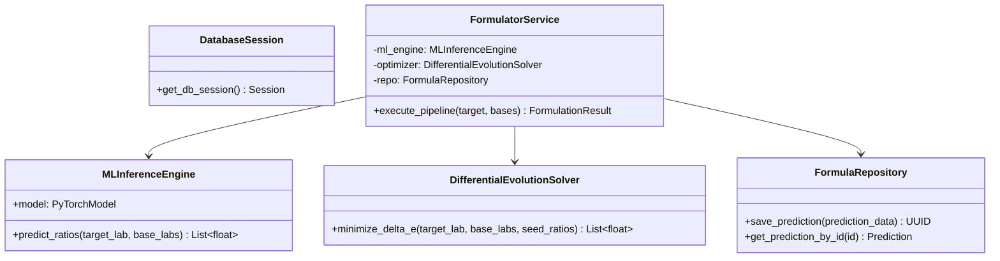
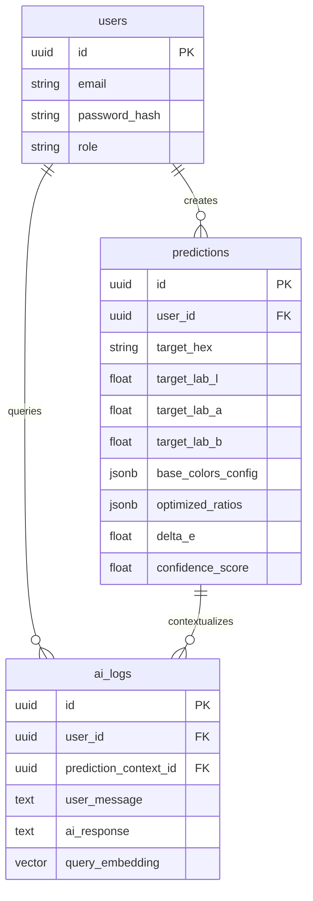
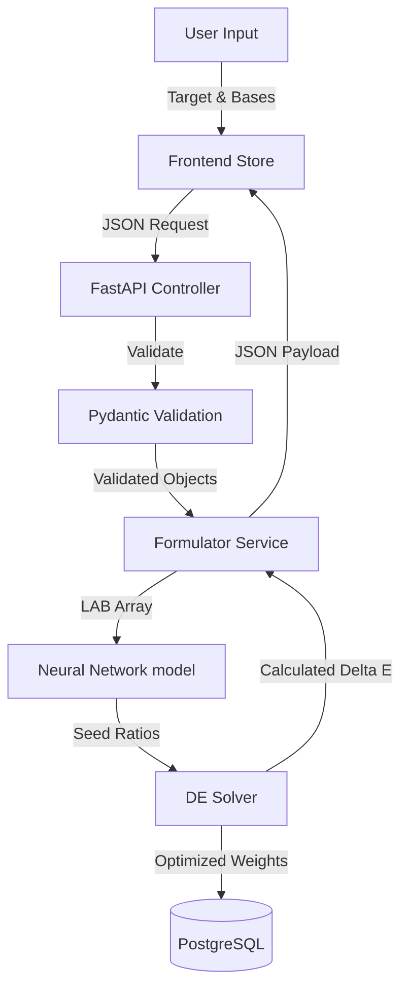

# Low-Level Design (LLD) Specification

## ChromaMind AI
**An Explainable AI-Powered Intelligent Color Formulation & Optimization Platform**

---

## 1. Project Overview & Module Breakdown

ChromaMind AI is an intelligent formulation system that matches colors using 3–8 base pigments. This document describes the implementation details, interfaces, and architecture layers.

### Module Breakdown
- **Frontend**: Next.js App Router, Zustand global store, visual color picker, Framer Motion transitions, and SHAP visualization dashboard.
- **Backend**: FastAPI Web Gateway containing routing controllers, business logic services, database access repositories, and Celery task execution queues.
- **Database**: PostgreSQL storing schemas and `pgvector` index tables.
- **ML Engine**: Python pipeline (PyTorch + XGBoost) generating initial ratios.
- **Optimization**: SciPy global optimization engine (Differential Evolution).
- **Explainability**: SHAP value calculation engine.
- **RAG Engine**: LlamaIndex/LangChain context retriever querying pgvector.

---

## 2. Directory and File Architecture

The repository directory structure is mapped out below at file-level detail:

```
chromamind-ai/
├── apps/
│   ├── frontend/
│   │   ├── src/
│   │   │   ├── app/
│   │   │   │   ├── layout.tsx         # Root Layout, registers theme providers
│   │   │   │   ├── page.tsx           # Landing/Auth route selection
│   │   │   │   └── dashboard/
│   │   │   │       └── page.tsx       # Main formulation console layout
│   │   │   ├── components/
│   │   │   │   ├── ColorPicker.tsx    # Chromatic coordinates selector
│   │   │   │   ├── RatioChart.tsx     # Formulation weight ratio bar visualizer
│   │   │   │   └── ShapForcePlot.tsx  # Renders SHAP contribution vectors
│   │   │   ├── store/
│   │   │   │   └── useColorStore.ts   # Zustand state management slice
│   │   │   └── utils/
│   │   │       └── colorMath.ts       # LAB/RGB coordinate conversions
│   └── backend/
│       ├── app/
│       │   ├── api/
│       │   │   └── predictions.py     # Endpoint routing for ML executions
│       │   ├── core/
│       │   │   ├── database.py        # SQLAlchemy session engines
│       │   │   └── config.py          # Pydantic global settings validation
│       │   ├── services/
│       │   │   ├── formulator.py      # Combines ML inference and DE Solver
│       │   │   └── rag.py             # Interfaces with LLM and Vector Index
│       │   └── main.py                # App bootstrap configuration
```

---

## 3. Diagrams

### 3.1 Class Diagram (Backend Services)



### 3.2 Entity-Relationship (ER) Diagram



### 3.3 Data Flow Diagram (Level 1)



---

## 4. Frontend Design

### Zustand Store (`useColorStore.ts`)
```typescript
interface ColorState {
  targetColor: { hex: string; lab: [number, number, number] };
  baseColors: Array<{ id: string; hex: string; lab: [number, number, number] }>;
  ratios: Array<{ baseId: string; ratio: number }>;
  deltaE: number | null;
  isLoading: boolean;
  setTargetColor: (hex: string) => void;
  addBaseColor: (color: { hex: string }) => void;
  executeFormulation: () => Promise<void>;
}
```

---

## 5. Backend Module Design

### Formulator Service (`app/services/formulator.py`)
```python
class FormulatorService:
    def __init__(self, ml_engine: MLInferenceEngine, optimizer: DESolver, repo: FormulaRepository):
        self.ml_engine = ml_engine
        self.optimizer = optimizer
        self.repo = repo

    async def execute_pipeline(self, target_lab: List[float], bases: List[Dict]) -> Dict:
        # Step 1: Predict seed ratios using Deep Learning model
        seed = self.ml_engine.predict_ratios(target_lab, [b["lab"] for b in bases])
        
        # Step 2: Fine-tune ratios using Differential Evolution search
        optimized_ratios = self.optimizer.minimize_delta_e(target_lab, [b["lab"] for b in bases], seed)
        
        # Step 3: Calculate Delta E
        delta_e = calculate_delta_e00(target_lab, mixed_color(bases, optimized_ratios))
        
        return {
            "ratios": optimized_ratios,
            "delta_e": delta_e,
            "confidence_score": 1.0 - (delta_e / 10.0)
        }
```

---

## 6. Optimization: Differential Evolution

### Objective Function Definition
The solver minimizes the Delta E difference:
```python
def objective_function(weights, target_lab, base_labs):
    # Weights must sum up to 1.0
    normalized_weights = weights / np.sum(weights)
    
    # Calculate mixed color coordinate in LAB space using physical color properties
    mixed_lab = mix_colors(normalized_weights, base_labs)
    
    return ciede2000(target_lab, mixed_lab)
```

---

## 7. Explainable AI: SHAP Calculation Engine
```python
import shap

class SHAPInterpreter:
    def __init__(self, model):
        self.model = model
        self.explainer = shap.KernelExplainer(self.model.predict, self.get_background_data())

    def explain(self, target_lab: List[float], bases: List[List[float]]) -> Dict[str, float]:
        features = np.array(target_lab + flatten(bases)).reshape(1, -1)
        shap_values = self.explainer.shap_values(features)
        return dict(zip([b.id for b in bases], shap_values))
```

---

## 8. Caching Strategy
- **Redis Cache Layer**: The FastAPI gateway checks Redis caches for duplicate color searches (hashed by target color HEX + sorted base color IDs) before invoking Celery task queues.
- **Cache TTL**: 24 Hours.

---

## 9. Security Design
- **Rate Limiting**: Enforced via FastAPI rate-limiter package, capping client queries to 60 calls/minute per authenticated user.
- **Secrets Management**: Read from environmental variables, injected via AWS Secrets Manager in production runtime environments.
