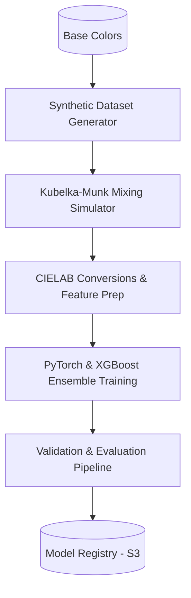

# Machine Learning & Optimization Architecture - ChromaMind AI

This document details the Machine Learning pipelines, target color space transformations, optimization logic (Differential Evolution), and Explainability integrations (SHAP).

---

## 1. Feature Engineering & CIELAB Space

Color matching cannot be reliably executed using RGB or HEX values because Euclidean distances in these spaces do not correspond to human visual perception. We transform all colors into the **CIE $L^*a^*b^*$ (CIELAB)** color space.

- **$L^*$ (Lightness)**: $0 \rightarrow 100$
- **$a^*$ (Red/Green coordinate)**: negative values indicate green, positive values indicate red.
- **$b^*$ (Yellow/Blue coordinate)**: negative values indicate blue, positive values indicate yellow.

### Delta E Similarity Calculation ($\Delta E_{00}$)
We use the **CIEDE2000 ($\Delta E_{00}$)** standard to calculate structural similarity between target and formulated colors. The formula handles lightness, chroma, and hue differences with specific scaling factors:

$$\Delta E_{00} = \sqrt{\left(\frac{\Delta L'}{k_L S_L}\right)^2 + \left(\frac{\Delta C'}{k_C S_C}\right)^2 + \left(\frac{\Delta H'}{k_H S_H}\right)^2 + R_T \left(\frac{\Delta C'}{k_C S_C}\right) \left(\frac{\Delta H'}{k_H S_H}\right)}$$

Where:
- $\Delta E_{00} < 1.0$: Imperceptible to the human eye (ideal target).
- $1.0 \le \Delta E_{00} \le 2.0$: Perceptible only by close observation.
- $\Delta E_{00} > 2.0$: Noticeable difference.

---

## 2. ML Engine Architecture & Pipelines



### 2.1 Synthetic Dataset Generator
Since physical color mixing data is scarce, we simulate initial formulations using **Kubelka-Munk theory**:
- Calculates light absorption ($K$) and scattering ($S$) coefficients for base paints.
- Formula for reflectance ($R$) of thick layers:
  $$\frac{K}{S} = \frac{(1 - R)^2}{2R}$$
- We generate 1,000,000 synthetic formulations by randomly combining 3-8 base colors in varying weight increments and simulating the resulting target $L^*a^*b^*$ coordinate.

### 2.2 Model Training & Hyperparameter Tuning
- **Models**: We train a Multi-Layer Perceptron (MLP) Regressor in PyTorch coupled with an XGBoost Regressor ensemble.
- **Inputs**: Target $L^*a^*b^*$ vector (size 3) + Flattened Base Color Vectors (size $8 \times 3$).
- **Outputs**: Ratios vector $W$ (size 8), where unselected bases default to 0.
- **Tuning**: Optuna is used for optimization (optimizing learning rate, depth, weight decays, batch size).

---

## 3. Optimization Architecture: Differential Evolution

The neural network yields a rapid approximation, but it lacks physical guarantees. We run optimization post-prediction.

### Differential Evolution Solver
We employ the **Differential Evolution (DE)** stochastic global optimization algorithm (via `scipy.optimize.differential_evolution`).

- **Objective Function**:
  $$\text{Minimize } f(W) = \Delta E_{00}(\mathbf{Target}, \mathbf{Mixed}(W))$$
- **Constraints**:
  - Bound constraint: $0.0 \le w_i \le 1.0$ for all $i$.
  - Linear constraint: $\sum_{i=1}^N w_i = 1.0$.
- **Starting Seed**: The initial population for DE is seeded with the ratio prediction output from the ML neural network. This hybrid approach converges within **150ms** (compared to >5s for pure DE).

---

## 4. Explainable AI: SHAP Integration

We use **SHAP (SHapley Additive exPlanations)** to build confidence with color scientists by explaining how base colors affected the prediction.

```
                  [ ML Input Coordinates ]
                             │
                             ▼
               ┌───────────────────────────┐
               │    SHAP Kernel Explainer  │
               └─────────────┬─────────────┘
                             │
            ┌────────────────┴────────────────┐
            ▼                                 ▼
   [ SHAP Value Metrics ]           [ Natural Language Parser ]
   Calculates coordinate            Converts math outputs into
   influence on outputs             expert explanations.
```

- **Method**: `shap.KernelExplainer` is initialized on the model using a representative background set of colors.
- **Interpretation**:
  - Positive SHAP values indicate a base color was added to satisfy the chroma direction.
  - Negative values indicate a base color was suppressed because its coordinates pull the mixture away from the target spectrum.
- **Output**: The values are passed to the frontend for chart generation and sent to the LLM agent to summarize as natural language.
