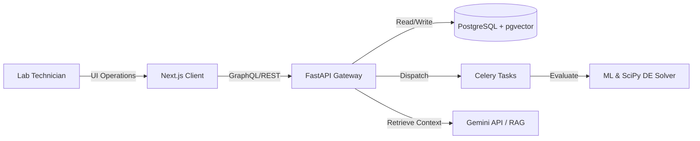
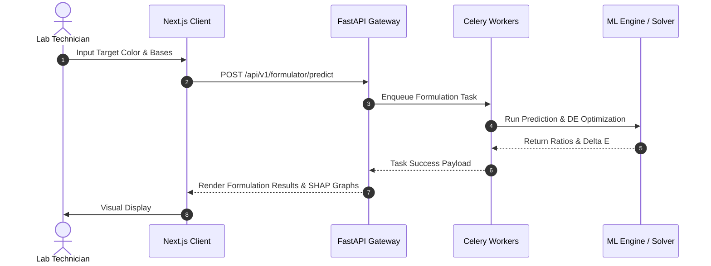

# Software Requirements Specification (SRS)

## ChromaMind AI
**An Explainable AI-Powered Intelligent Color Formulation & Optimization Platform**

---

### Document Control

| Detail | Value |
|---|---|
| **Standard** | IEEE Std 830-1998 Compliant |
| **Status** | Approved / Production-Ready |
| **Date** | August 7, 2026 |
| **Organization** | ChromaMind AI Corp |

---

### Version History

| Version | Date | Author | Description |
|---|---|---|---|
| v1.0.0 | 2026-08-07 | Principal AI Solutions Architect | Initial complete baseline release |

---

## Table of Contents
1. [Introduction](#1-introduction)
2. [Business Problem](#2-business-problem)
3. [Project Vision & Objectives](#3-project-vision--objectives)
4. [Stakeholder Analysis](#4-stakeholder-analysis)
5. [Product Perspective](#5-product-perspective)
6. [Overall Product Description](#6-overall-product-description)
7. [User Personas & Stories](#7-user-personas--stories)
8. [Functional Requirements](#8-functional-requirements)
9. [System Features & Workflows](#9-system-features--workflows)
10. [Technical Requirements (API, DB, ML, RAG, XAI)](#10-technical-requirements)
11. [Non-Functional Requirements](#11-non-functional-requirements)
12. [Business Rules, Assumptions & Constraints](#12-business-rules-assumptions--constraints)
13. [Operations (Deployment, Monitoring, Logging)](#13-operations)
14. [Acceptance Criteria & Risks](#14-acceptance-criteria--risks)
15. [Glossary & Appendices](#15-glossary--appendices)

---

## 1. Introduction

### Purpose
This document specifies the complete Software Requirements Specification (SRS) for ChromaMind AI. It establishes functional, non-functional, interface, and execution requirements for the platform.

### Scope
ChromaMind AI is an enterprise platform combining Deep Learning models, Differential Evolution global search optimization, SHAP Explainable AI, and RAG-powered LLM agents. The system provides real-time optimal mixing formulations for a target color given 3 to 8 available base pigments.

### Definitions & Abbreviations
- **CIELAB**: $L^*a^*b^*$ color space.
- **Delta E ($\Delta E_{00}$)**: Color difference calculation standard.
- **DE**: Differential Evolution optimization.
- **XAI**: Explainable AI.
- **RAG**: Retrieval-Augmented Generation.

### References
- IEEE Std 830-1998, *IEEE Recommended Practice for Software Requirements Specifications*.
- CIE Publication 142-2001, *Improvement to Industrial Color-Difference Evaluation*.

---

## 2. Business Problem
Traditional industrial color formulation (paints, textiles, inks) relies on manual trial-and-error processes by expert colorists or basic, rigid spectrophotometer software. This leads to:
- High resource and colorant waste.
- Slow turnaround times for custom batch creations.
- Lack of explainability in automated color matching outputs, leading to trust issues.

---

## 3. Project Vision & Objectives
Provide an explainable, self-optimizing platform that produces formulations under a Delta E ($\Delta E_{00}$) threshold of 1.0 in sub-second inference times, complete with natural language explanations and interactive color-theory advice.

---

## 4. Stakeholder Analysis
- **User (Color Chemist / Lab Technician)**: Inputs target colors, manages bases, reviews mixes.
- **Administrator**: Controls API keys, overrides default thresholds, manages billing and users.
- **ML Engineer**: Trains, monitors, and evaluates formulation models.
- **Developer**: Integrates components, maintains the API layer and frontend client.

---

## 5. Product Perspective
ChromaMind AI is designed as a modular Web Application operating within an enterprise ecosystem. It interfaces with database servers, vector databases, external LLMs, and local GPU/CPU execution contexts.

### System Context Diagram



---

## 6. Overall Product Description
The platform provides a browser-based frontend where technicians can choose base pigments (3-8 colors) and a target color coordinate. The backend executes a fast-inference MLP prediction, refines it using Differential Evolution, calculates SHAP scores, and presents the formulation alongside a RAG-powered chat window explaining color choices.

---

## 7. User Personas & Stories

### User Personas
- **Dr. Sarah Carter (Senior Color Chemist)**: 12+ years of experience in coating formulations. Demands scientific precision, exact LAB metrics, and explainability.
- **Markus Vance (Lab Technician)**: Focuses on speed and operational execution. Needs simple directions, weight ratios, and quick feedback.

### User Stories
- *As a Lab Technician*, I want to select 5 specific base colors and paint code parameters so I can generate a mix with less than 1.0 Delta E.
- *As a Color Chemist*, I want to see a SHAP explanation of why a particular green base was omitted, so I can verify chemical properties before mixing.

---

## 8. Functional Requirements

### FR-AUTH: Authentication
- **FR-AUTH-1**: Enforce secure JWT registration, login, and session refreshes.
- **FR-AUTH-2**: Enforce role-based access control (Admin, scientist, user).

### FR-FORM: Color Selection & Formulation
- **FR-FORM-1**: Allow user to pick 3 to 8 base colors via HEX code or RGB/LAB input.
- **FR-FORM-2**: Provide a visual target color picker (HEX, RGB, CIELAB input fields).
- **FR-FORM-3**: Predict mixing ratios using ML and optimize them using Differential Evolution.
- **FR-FORM-4**: Calculate and render final similarity metric ($\Delta E_{00}$) and confidence scores.

### FR-RAG: AI Copilot & Explainability
- **FR-RAG-1**: Generate natural language explanations of color recommendations using SHAP metrics.
- **FR-RAG-2**: Provide interactive QA chat context-aware of color theory documentation and current prediction parameters.

---

## 9. System Features & Workflows

### Use Case Diagram

```mermaid
usecaseDiagram
    actor "Lab Technician" as Tech
    actor "Admin" as Adm
    
    usecase "Formulate Color" as UC1
    usecase "Explain Ratios (SHAP)" as UC2
    usecase "Query AI Copilot" as UC3
    usecase "Manage Settings" as UC4
    
    Tech --> UC1
    Tech --> UC2
    Tech --> UC3
    Adm --> UC4
```

### Sequence Diagram: Color Formulation Workflow



---

## 10. Technical Requirements

### Database Requirements
- PostgreSQL 15+ storage.
- `pgvector` for embedding arrays matching RAG documents.

### Machine Learning Requirements
- Conversion of color vectors into CIELAB space.
- Training models (PyTorch MLP and XGBoost).
- Hyperparameter tuning utilizing Optuna.

---

## 11. Non-Functional Requirements

### Performance & Latency
- **NFR-PERF-1**: ML ratio predictions must return in under 50ms.
- **NFR-PERF-2**: Combined ML and Differential Evolution search must finish in under 250ms.

### Scalability
- **NFR-SCAL-1**: The system must handle 100,000 active sessions with horizontal API scaling.

---

## 12. Business Rules, Assumptions & Constraints

### Business Rules
- **BR-1**: The sum of mixing ratios for any recommended formulation must equal exactly 1.0 (100%).
- **BR-2**: Optimization processes must only run if base colors count is between 3 and 8 inclusive.

---

## 13. Operations

### Logging & Monitoring
- **OP-LOG-1**: Structured JSON logging on backend APIs using `structlog`.
- **OP-MON-1**: Prometheus export endpoints exposing request counts, database latencies, and worker queues.

---

## 14. Acceptance Criteria & Risks

### Acceptance Criteria
- 95% of predicted color matches must yield a calculated $\Delta E_{00}$ of less than 1.0 on test sets.
- Average response time for formulation generation must remain under 300ms.

---

## 15. Glossary & Appendices
Refer to [DATABASE.md](./DATABASE.md) and [ML.md](./ML.md) for supporting configurations and DDL references.
